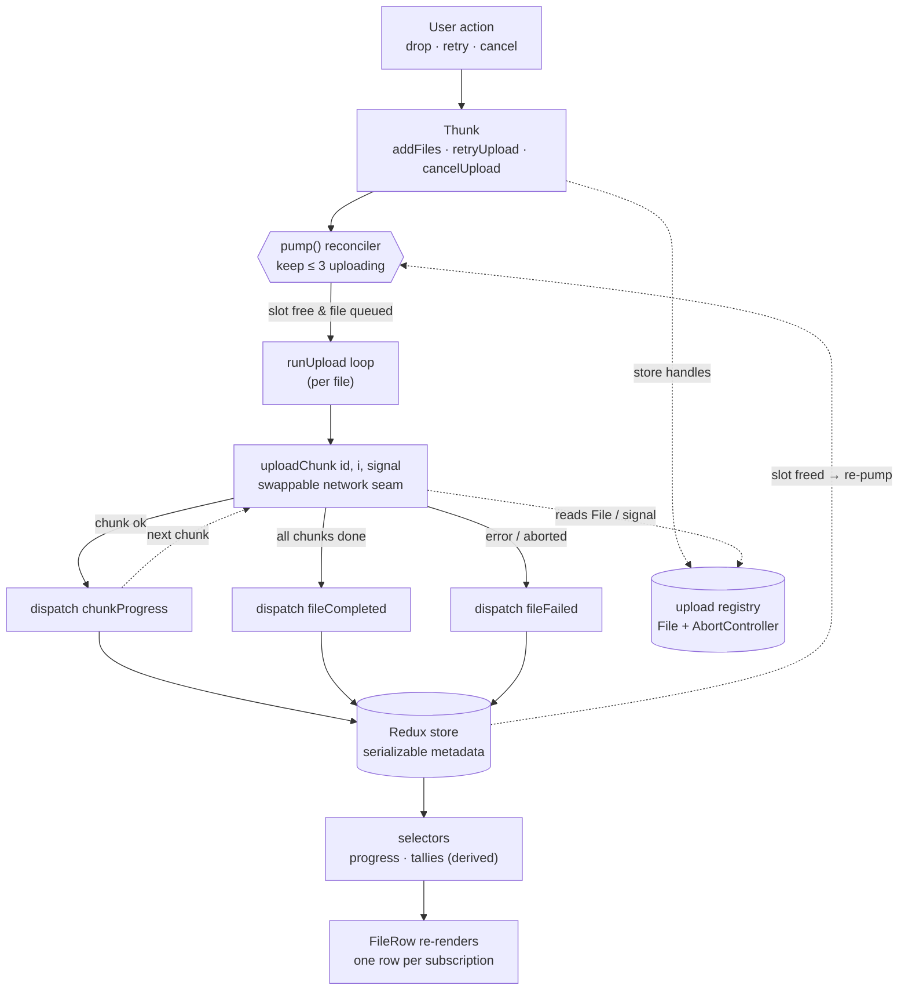
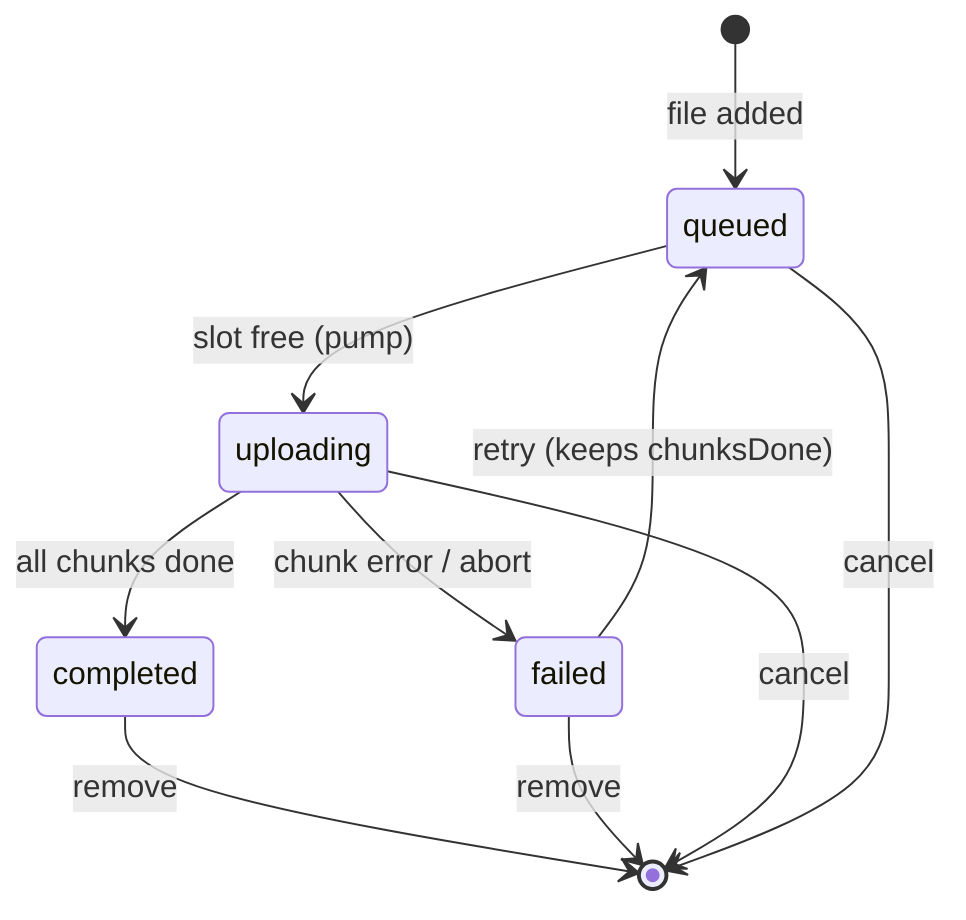

# File Upload Manager

A Google-Drive-style uploader: drop a batch of files, watch a few upload in parallel while the rest queue, and retry or cancel any one — with chunked transfers, resumable failures, and a capped concurrency of three.


🔗 **[Live Demo](https://file-upload-manager-beta.vercel.app/)** &nbsp;·&nbsp;

---

## ✨ Features

- 📥 **Drag-and-drop or click** to add multiple files at once.
- 📊 **Per-file progress, size, and status** — queued · uploading · completed · failed.
- ↻ **Retry a failed upload** — it resumes from the last completed chunk, not from zero.
- ✕ **Cancel or remove** any file, mid-flight or after.
- ⚡ **Concurrency cap of three** — extra files queue and promote automatically as slots free.
- 🧩 **Chunked transfers (20 per file)** — so progress and resume are real, not a smoothed-over animation.
- 🎛️ **Built-in simulator** — trigger failures and tune latency on demand to exercise the retry/resume paths (a dev aid, collapsed by default).

## 🧩 Tech stack

**React 18** · **Redux Toolkit 2** · **React-Redux 9** · **Vite 5** · **Tailwind CSS 4** · **Vitest 2**

No backend, router, or component library — the transfer logic is the point, so the dependency surface is kept small.

---

## 🔄 How it works

A user action dispatches a thunk. After **every** event, a single reconciler — `pump()` — scans the store and starts queued files until three are uploading. Each active upload walks its chunks through `uploadChunk` (the one place that "talks to the network"), dispatching progress as chunks land and a terminal action when it finishes or fails. The store holds only **serializable metadata**; progress and tallies are **derived** by selectors; and each row **subscribes to its own file**, so a progress tick re-renders one row rather than the whole list. The live `File` and `AbortController` handles sit in a side registry, keyed by the same id.



Each file moves through a small state machine:



---

## 🧠 Key decisions

**What lives in Redux — and what sits beside it.** The app tracks many files across unrelated components, but an upload also involves live browser objects — the `File` itself and an `AbortController` — that can't be serialized. So the store holds only serializable metadata, while the living handles go in a plain `Map` keyed by the same file id. The store stays predictable and easy to snapshot, log, and test, and the awkward objects live exactly where they're needed and nowhere else.

**Derive state instead of storing it.** Progress and the running tallies could be saved as fields and bumped on every tick — but duplicated state is how a UI starts disagreeing with itself. Instead only raw facts are stored (chunks done, status), and progress and tallies are computed by selectors. There's one source of truth, so a number on screen can't drift from reality; the only cost is recomputation on read, which is negligible here and memoizable if it ever isn't.

**One idempotent `pump()`, not a queue object.** "Run at most three at once, and start the next queued file the moment a slot frees" is easy to get subtly wrong when two things track what's running. So rather than a queue with its own bookkeeping, a single function reads the store and starts files until three are active — and it runs after every event. Because starting a file flips its status synchronously, calling it twice can't double-start anything, so it's always safe to just call it again. Concurrency, promotion, resume, and cancel all fall out of that one re-runnable rule — the same converge-to-desired-state idea React uses to render.

**Chunked uploads, and a bar that shows the chunks.** A percentage bar can fake smoothness, but resuming a failed upload only means something if the file is actually in parts. Each file transfers as 20 discrete chunks, and the progress bar draws one cell per chunk — filled cells are chunks that landed. Resume becomes "continue from the first unfinished chunk" instead of starting over, and the bar stops being decoration: a stalled file shows exactly where it stopped, which is precisely where it will pick back up.

**A single swappable network seam.** There's no backend here, but the code shouldn't be shaped so that adding one forces a rewrite. Everything network-facing lives behind one function, `uploadChunk(id, index, { signal })` — today it simulates latency and failures, tomorrow its body becomes a `fetch()` of a byte range. The scheduler, progress, retry, and cancel logic are written against that seam and wouldn't change when a server appears; it's also why the simulator exists, since controllable failures at that seam let the retry and resume paths be demonstrated on demand.

---

## 📁 Project structure

Organized **by feature, not by type** — everything about a concern lives together, so a change stays in one folder.

```
src/
├─ main.jsx                     app entry: mount + wire uploader to live settings
├─ App.jsx                      layout: header, dropzone, tallies, list, simulator
├─ store.js                     Redux store
├─ index.css                    tokens, fonts, base styles
├─ features/
│  ├─ files/                    the upload domain, all in one place
│  │  ├─ filesSlice.js            state, reducers, derived selectors
│  │  ├─ scheduler.js             thunks: pump(), runUpload, add/cancel/retry
│  │  ├─ uploader.js              the simulated chunk uploader (network seam)
│  │  ├─ uploadRegistry.js        File + AbortController handles, keyed by id
│  │  ├─ constants.js             statuses, chunk count, concurrency cap
│  │  └─ scheduler.test.js        invariants, colocated with the code
│  └─ settings/
│     └─ settingsSlice.js         simulator knobs
├─ components/                  DropZone · FileList · FileRow · SegmentedBar · DevPanel · ThemeToggle
└─ utils/                       formatBytes
```

---

## 🚀 Getting started

Requires **Node 20+**.

```bash
npm install      # install dependencies
npm run dev      # start the dev server (prints a localhost URL)
npm run build    # production build into dist/
npm run preview  # serve the production build locally
```

## 🧪 Tests

```bash
npm run test
```

The scheduler holds the load-bearing logic, so that's where the tests are. Five specs pin the invariants that a refactor could quietly break: concurrency never exceeds three, a completion promotes exactly one queued file, cancel frees a slot, retry resumes from the correct chunk, and cancelling a queued file leaves active uploads untouched.

---

## 📌 Limitations & next steps

- **Uploads are simulated** — there's no real server; `uploadChunk` is the seam where a `fetch()`-based implementation would slot in.
- **State is in-memory** — nothing persists across a page reload.
- **Chunk count is fixed** at 20 per file, regardless of size.

Natural next steps: a real `fetch`-based `uploadChunk` with byte-range slicing, server-driven resume (ask which chunks already landed), and concurrency that adapts to connection speed.
